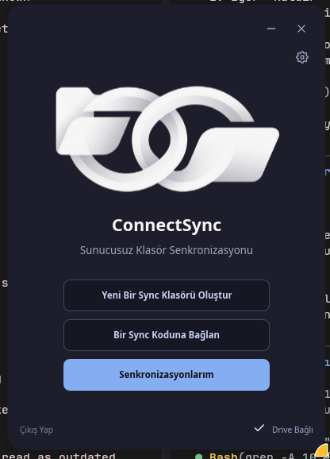
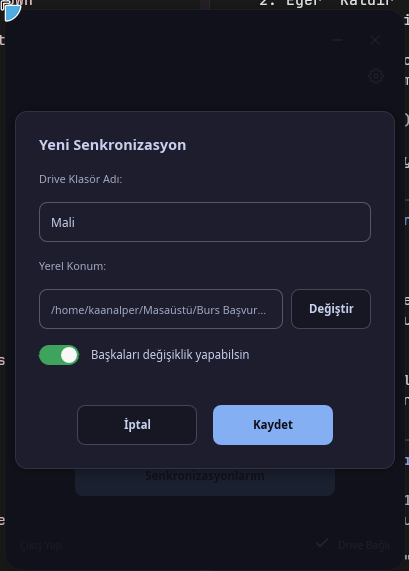
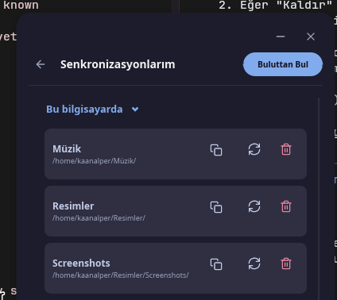

<div align="center">
  
  
  <h1>ConnectSync</h1>
  <p><strong>Zero-Knowledge, Google Drive Destekli P2P Senkronizasyon İstemcisi</strong></p>

  [](https://www.rust-lang.org/)
  [](https://slint.dev/)
  [](LICENSE)
</div>

<br>

**ConnectSync**, kendi Google Drive hesabınızı veya başkasının oluşturduğu Drive köprülerini kullanarak uçtan uca şifrelenmiş (Zero-Knowledge) dosya senkronizasyonu sağlayan modern bir masaüstü uygulamasıdır. Kullanıcı dostu, şık ve karanlık temalı bir arayüz ile Slint üzerinde geliştirilmiştir.

## ✨ Özellikler

* **Zero-Knowledge Şifreleme**: Dosyalarınız bilgisayarınızdan çıkmadan önce Argon2 + AES-256-GCM ile şifrelenir. Google dahil hiç kimse içeriğini göremez.
* **P2P Hissiyle Drive Senkronizasyonu**: İstediğiniz dosyayı seçip yarattığınız kod ile (örneğin `cs-XXXX-YYYY`) herhangi bir PC'den kodsuz / anında o dosyaya erişebilirsiniz.
* **Kodsuz "Kendi Sync'lerim" Erişimi**: Kendi dosyalarınızı eşlerken o upuzun kodları saklamanıza gerek yok. ConnectSync, Google Drive'ınızdaki gizli `appDataFolder` vault'unu kullanarak kendi bilgisayarlarınız arasında şifreleri otomatik taşır.
* **Başkasıyla Paylaşım**: Ürettiğiniz kodu arkadaşınıza verdiğinizde, arkadaşınız **kendi kotasından yemeden** sizin Drive'ınıza (şifreli bir tünel ile) dosya yazabilir ve okuyabilir.
* **Arka Plan İşlemleri**: Uygulama açık olduğu sürece (veya sistem tepsisine küçültüldüğünde) inotify/ReadDirectoryChangesW ile değişiklikleri anında buluta atar.

## 📸 Ekran Görüntüleri

<div align="center">
  
  
  
</div>

## 🚀 Hızlı Kurulum

### Linux İçin Tek Satır Yükleyici

Uygulamayı derlemek, sisteminize kurmak ve `.desktop` dosyasını oluşturmak için:

```bash
curl -sL https://raw.githubusercontent.com/kaanalper/ConnectSync/main/install.sh | bash
```

### Windows İçin

Yakında yerleşik yükleyici `.exe` olarak yayınlanacaktır.

## 💻 Geliştirme (Build)

Projeyi yerel olarak derlemek için Rust ve Cargo yüklü olmalıdır.

```bash
git clone https://github.com/kaanalper/ConnectSync.git
cd ConnectSync
cargo build --release
```

Derlenen dosya `target/release/connect_sync` (Windows'ta `connect_sync.exe`) dizininde olacaktır.

## 🛠 Kullanılan Teknolojiler

- **[Rust](https://www.rust-lang.org/)**: Performans ve bellek güvenliği için.
- **[Slint](https://slint.dev/)**: Modern, GPU hızlandırmalı ve akıcı masaüstü arayüzü için.
- **[Tokio](https://tokio.rs/)**: Asenkron görevler, watcher thread'leri ve API istekleri için.
- **[Reqwest](https://docs.rs/reqwest/) & Google Drive API**: Bulut dosya depolama ve senkronizasyon altyapısı için.

## 📜 Lisans

Bu proje [MIT Lisansı](LICENSE) ile lisanslanmıştır. Dilediğiniz gibi kullanabilir ve geliştirebilirsiniz.
